# Office Online Server 2016 详细安装步骤即问题总结


由于公司需要，自己一直在研究office online server 2016这款在线浏览文档的软件，其中遇到了很多问题，以下是自己综合网上的资料和自己的搭建过程写出来的安装步骤，亲测可用，值得注意的是在安装后除word格式的文件其他都可以进行在线浏览，找了差不多两周的问题才知道是语言包的问题，具体没做深入研究，所以这个安装步骤就没有使用语言包进行安装，默认为英文使用
首先需要准备两套服务器，而且都必须是Windows Server 2012 R2版本的服务器，推荐使用下方红框内的ISO镜像，其他版本的安装更新时会报错

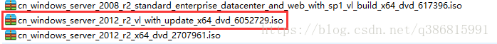 

附文件下载地址：https://pan.baidu.com/s/1A1h5qcvdShiYcs_pJ8OCRA?pwd=ylre

<font color="red">**注：域控和OOS服务器需要给administrator设置密码，且设置成一样的密码最好**</font>

## 1.环境安装

### 1.1 搭建域控服务器

1. 打开服务器管理器，添加角色和功能；

   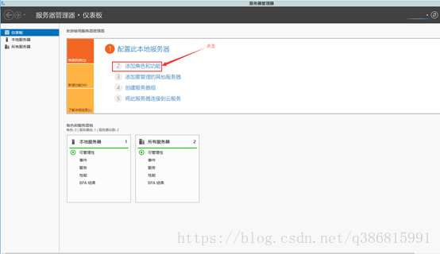 

2. 下一步；

   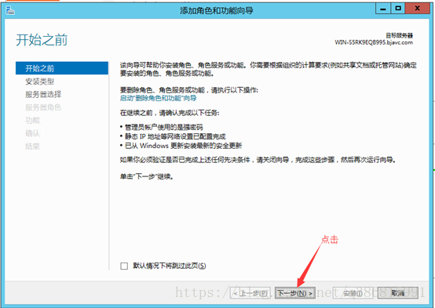 

3. 下一步；

   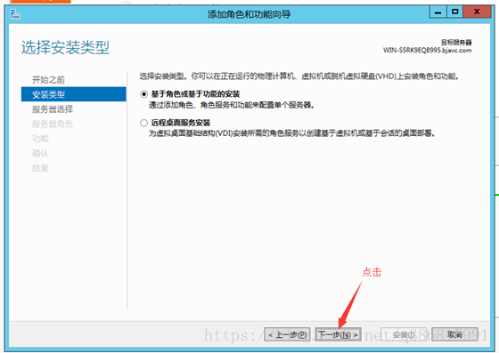 

4. 下一步；

   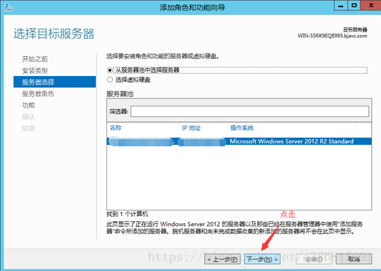 

5. 下一步，选择添加AD域服务，同时添加所需功能；

   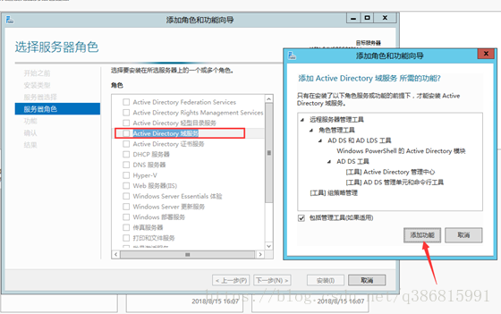 

6. 下一步，安装功能；

   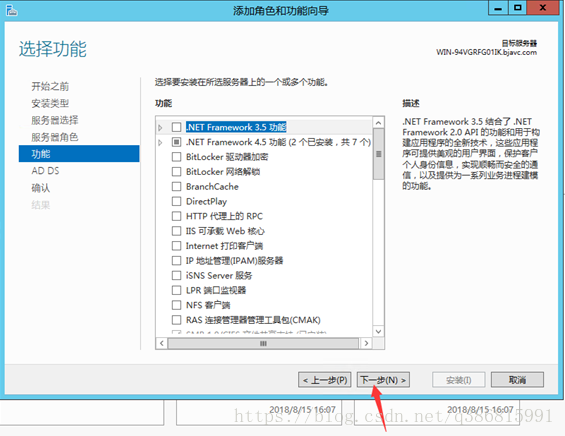 

7. 下一步

   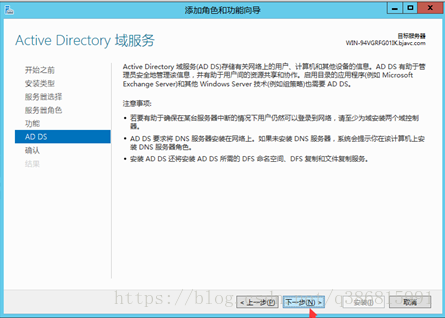 

8. 点击安装，安装功能，安装完成后点击关闭。

   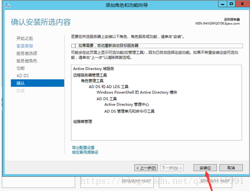 

9. 点击“升级为域控制器” ；

   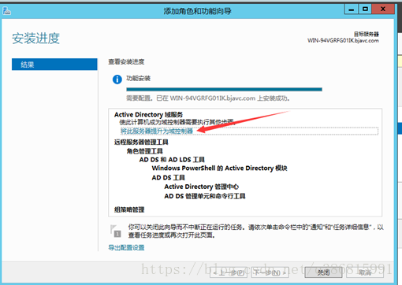 

10. 进入AD域服务器配置向导，选择添加新林，并输入根域名，点击下一步；

    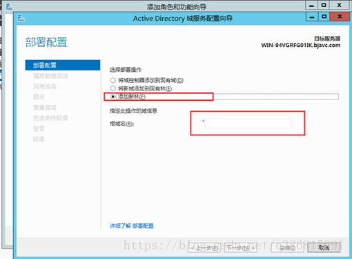 

11. 填写密码，下一步 ；

    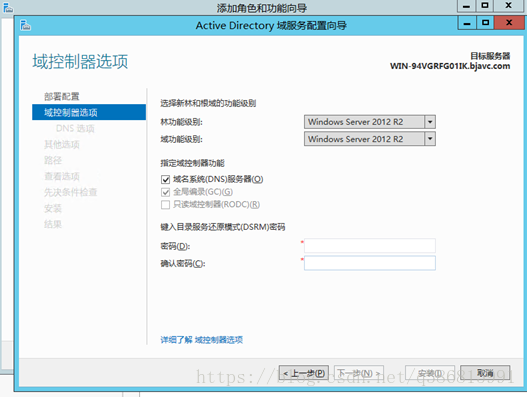 

12. 提示DNS无法创建，不用管，继续下一步

    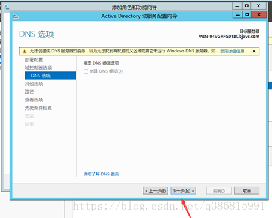 

13. 13.下一步

    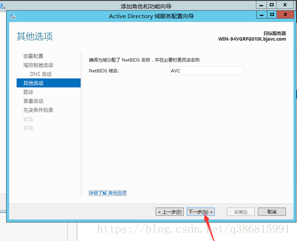 

14. 安装路径，默认，下一步；

    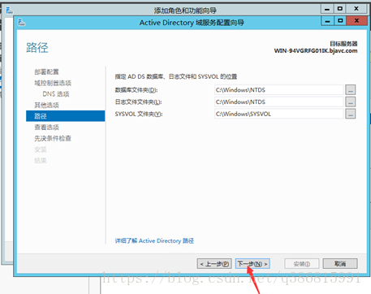 

15. 查看选项，默认，下一步；

    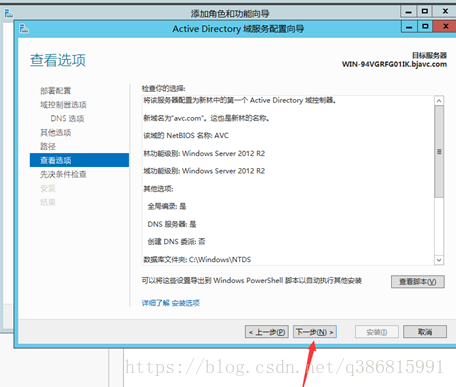 

16. 16.点击安装，安装完成后重启系统即可

    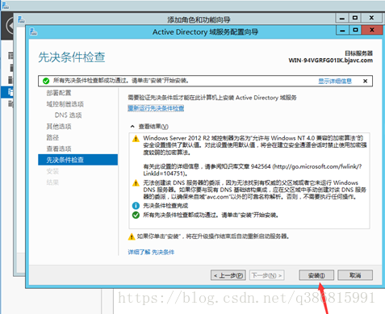 

### 1.2 将Office Online Server服务器加入域服务器 

1. 打开控制面板->网络和Internet->网络和共享中心，并点击更改适配器设置

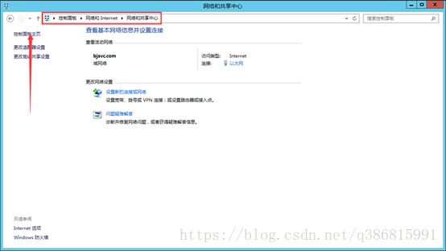 

2. 右击网络并打开属性，双击IPV4

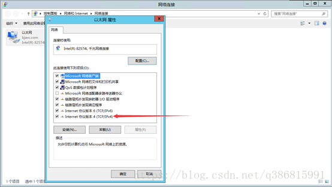 

3. 将DNS服务器配置为刚才配置好的域控服务器IP

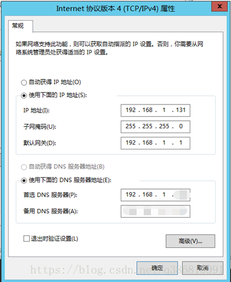 

4. 点击确定

5. 右键电脑，点击属性，点击高级系统设置

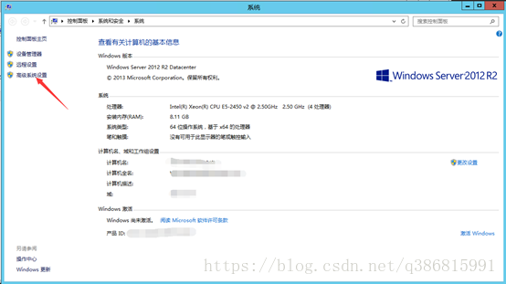 

6. 选择计算机名，并点击更改

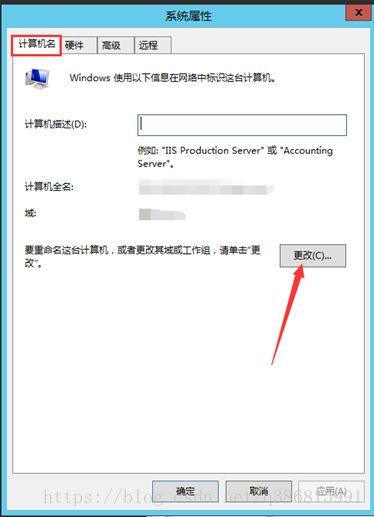 

7. 选择域，并输入之前域控服务器中配置的根域名

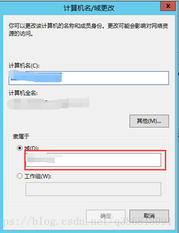 

8. 点击确定，然后输入对应的用户名密码即可，更改完成后重启电脑

### 1.3为 Office Online Server 安装必备软件

打开 Microsoft PowerShell 提示符，然后运行此命令示例来安装必需的角色和服务。

```
Add-WindowsFeature Web-Server,Web-Mgmt-Tools,Web-Mgmt-Console,Web-WebServer,Web-Common-Http,Web-Default-Doc,Web-Static-Content,Web-Performance,Web-Stat-Compression,Web-Dyn-Compression,Web-Security,Web-Filtering,Web-Windows-Auth,Web-App-Dev,Web-Net-Ext45,Web-Asp-Net45,Web-ISAPI-Ext,Web-ISAPI-Filter,Web-Includes,InkandHandwritingServices,NET-Framework-Features,NET-Framework-Core,NET-HTTP-Activation,NET-Non-HTTP-Activ,NET-WCF-HTTP-Activation45,Windows-Identity-Foundation,Server-Media-Foundation
```

### 1.4 Microsoft .NET Framework4.5.2

1、右键以管理员身份运行 Microsoft  .NET Framework4.5.2安装包，勾选“我已阅读并接受许可条款”点击“安装”。

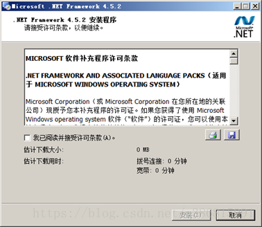 

2、安装进行中，待进度完成。

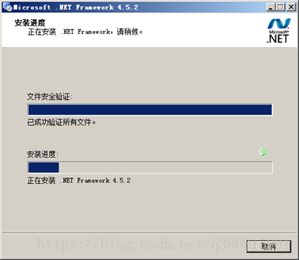 

3、点击“完成”，完成Microsoft.NET Framework 4.5.2的安装。

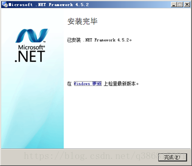 

### 1.5 Visual C++ Redistributable Packages for Visual Studio 2013

1、右键以管理员身份运行Visual C++ Redistributable Packages  for Visual Studio 2013安装包，勾选“我已阅读并接受许可条款”点击“安装”。

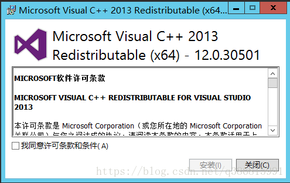 

2、安装进行中，待进度完成。

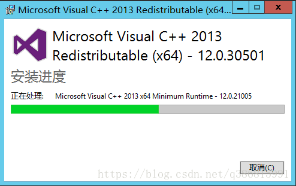 

3、点击“关闭”，完成 Visual C++ Redistributable  Packages for Visual Studio 2013的安装。

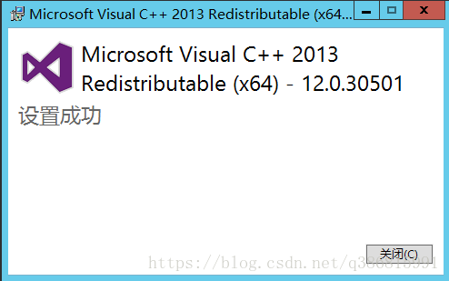 

### 1.6Visual C++ Redistributable for Visual Studio 2015

1、右键以管理员身份运行Visual C++ Redistributable for Visual Studio 2015安装包 ，勾选“我已阅读并接受许可条款”点击“安装”。

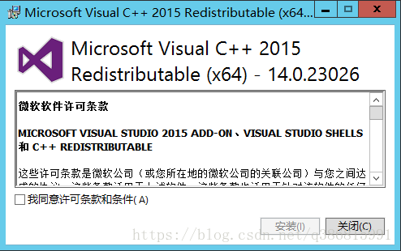 

2、安装进行中，待进度完成。

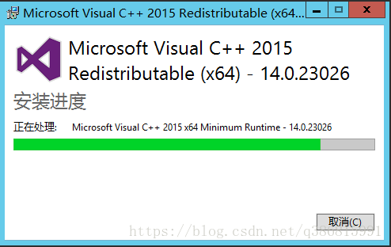 

3、点击“关闭”，完成Visual C++ Redistributable Packages for Visual Studio 2013的安装。

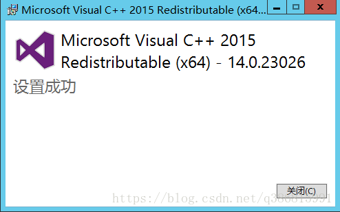 

### 1.7 Microsoft.IdentityModel.Extention.dll

1、右键以管理员身份运行Microsoft.IdentityModel.Extention.dll 安装包，勾选“I accept the terms in the License Agreement”点击“install”。

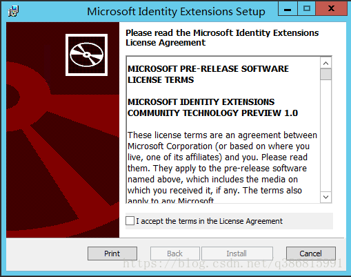 

2、安装进行中，待进度完成。

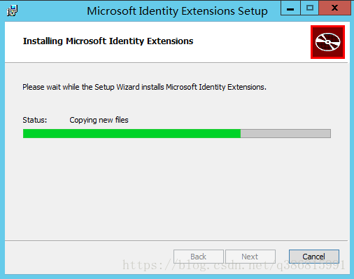 

3、点击“关闭”，完成Visual C++ Redistributable Packages for Visual Studio 2013的安装。

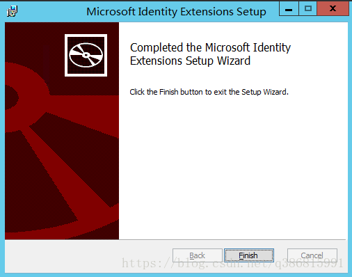 

### 1.8 Windows8.1-KB2999226-x64.msu

1. 将下载好的Windows8.1-KB2999226-x64.msu双击打开即可安装

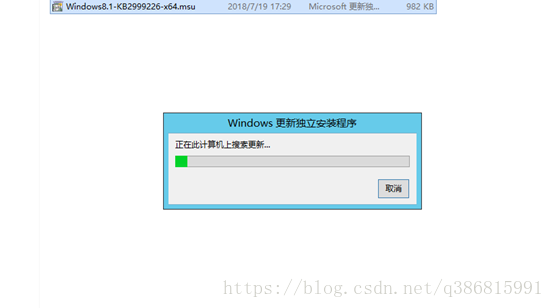 

## 2.软件安装部署

### 2.1 office online sevrer 2016

1. 将下载好的office online  server 2016的安装包解压好，并点击图中标注文件夹

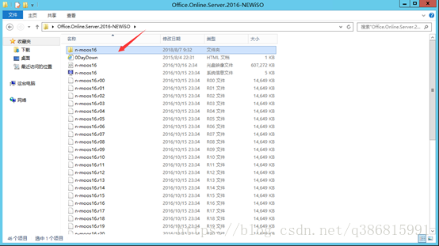 

2. 点击setup.exe

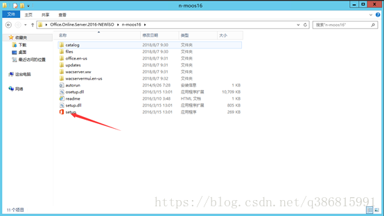 

3. 勾选“I accept the terms of this Agreement”点击“continue”。

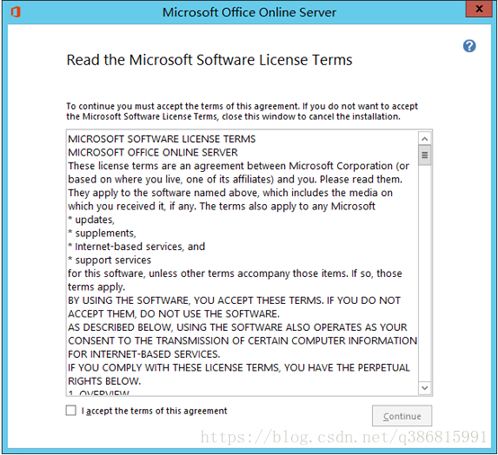 

4. 默认安装路径，点击“install now”

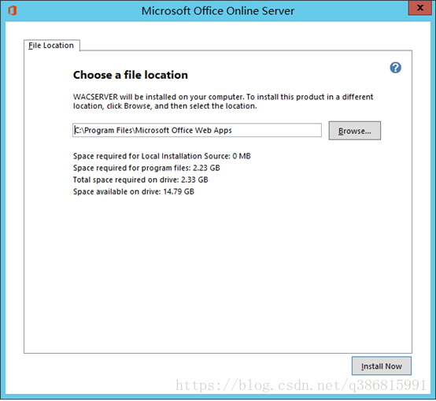 

5. 安装进行中，待进度完成。

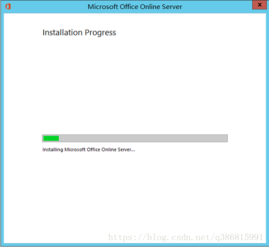 

6. 安装完成

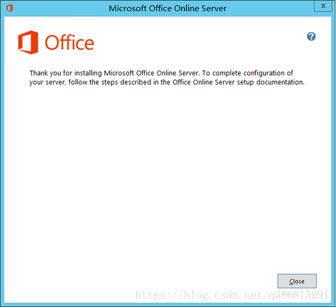 

### 2.2 相关配置

#### 2.2.1 office online server 

1. 安装完成后，打开PowerShell，开始配置office online server

```
输入：New-OfficeWebAppsFarm –InternalURL “http://192.168.1.131” –AllowHttp –EditingEnabled -OpenFromUrlEnabled
```

<font color="red">**注：如果输入命令报错，请重新启动电脑**</font>

```
> -InternalURL：内网浏览地址，http://xx.domin.com 其中 xx表示计算机名 domin.com 表示域名 也可以设置为对应的IP地址
> -ExternalURL：外网浏览地址
> -AllowHttp  ： 允许80端口访问
> -EditingEnabled 允许编辑office
> -CacheLocation： 缓存文件存放路径 默认是C:/ProgramData/Microsoft/OfficeWebApps/Working/d 
> -CacheSizeInGB： 最大缓存文件大小 单位GB 默认为15GB
```

<font color="red">**注：若http:// 192.168.1.131/hosting/discovery 能登录，http://192.168.1.131/op/generate.aspx显示“服务器错误”，控制台输入Set-OfficeWebAppsFarm -OpenFromUrlEnabled:$true即可访问成功**</font>

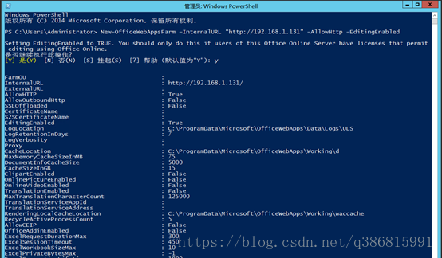 

2. 输入Y

3. 设置成功

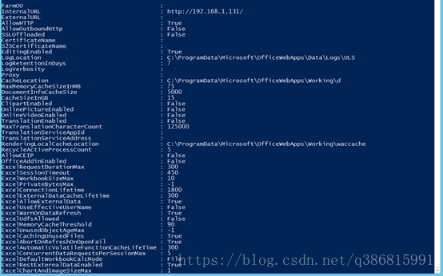 

4. 输入设置好的地址进行访问，若显示为下图，则部署成功

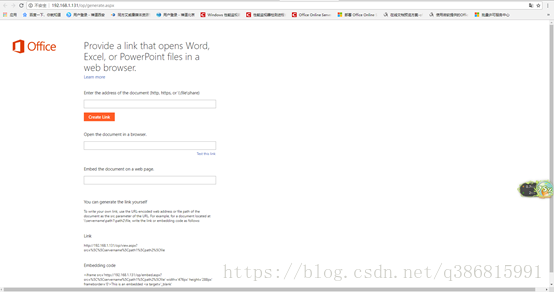 

#### 2.2.2 文档地址配置

1. 由于微软这款软件对IP有访问限制，所以需将IP转化为域名进行访问，所以需要进行配置，来让软件自动进行域名转化为IP，具体路径如下

<font color="red">**注：此IP是指要访问文档路径的IP**</font>

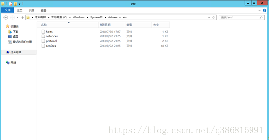 

2. 打开hosts文件，在其中添加对应IP和自定义的域名，即可访问

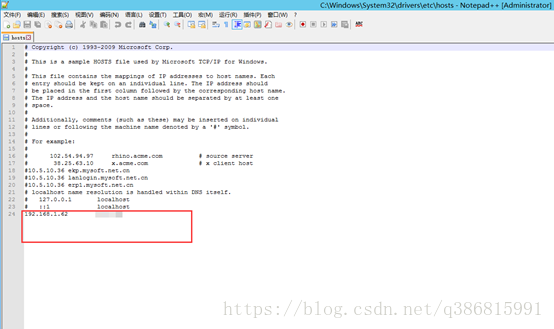 

#### 2.2.3 大文件转码配置（必须配置）

1. 安装后的office online server 对大文件会有限制，所以需要配置才能进行访问，具体配置路径如下

```
C:/Program Files/Microsoft Office Web Apps/OpenFromUrlWeb/Settings_Service.ini
```

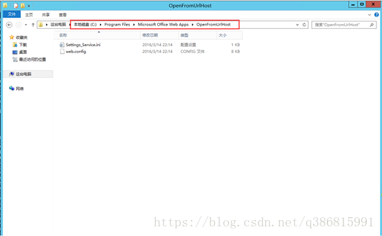 

```
C:/Program Files/Microsoft Office Web Apps/OpenFromUrlHost/Settings_Service.ini
```

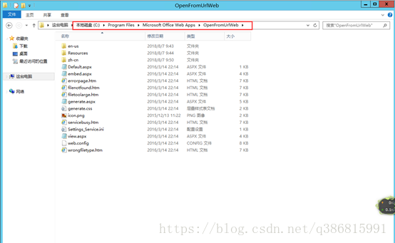 

2. 将上面两个文件夹中的settings文件进行修改，在其中填入并保存

```
OpenFromUrlMaxFileSizeInKBytes=(System.Int32)512000
```

<font color="red">**注意后面不要加分号**</font>

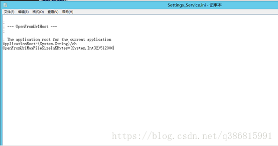 

3. 个别PPTX不能预览

```
C:/Program Files/Microsoft Office Web Apps/PPTConversionService/Settings_Service.ini
```

加上以下参数

```
UseGDIPlus=(System.Boolean)true
```

4. 配置完成后打开CMD命令，输入services.msc打开服务，并找到office online服务

 

5. 右键重启服务即可

#### 2.2.4 访问文档是否可以进行转码

例：访问 http://myscloud.cn/test.xlsx

1. 将上述网址填入第一行，然后点击create link即可生成浏览网址

 

2. 点击test this link进行测试

 

3. 浏览文档 **word、excel、ppt、pdf（注意：文档链接必须可以被直接访问，且需要是域名不能是 IP，本机可配置 HOST 测试用）**

 

## 注意事项:

1.安装完在创建场之前，Office Online 服务是无法启动的，不要在这里纠结，直接创建场

2.预览时文档路径尽量不要出现中文和特殊符号如[ ] 空格 等，可能会出现奇怪的问题

3.**Office Online不会加载IP地址的Doc源, 读取的地址必须是带域名的**