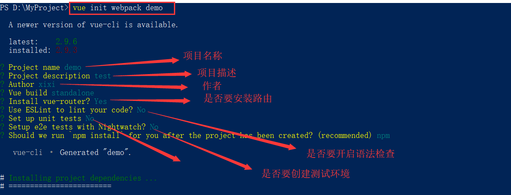
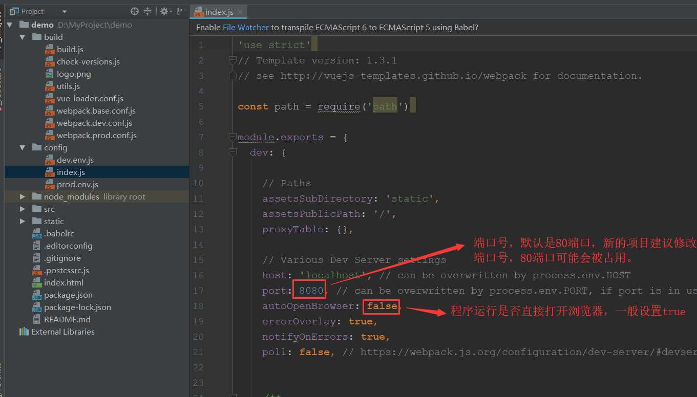
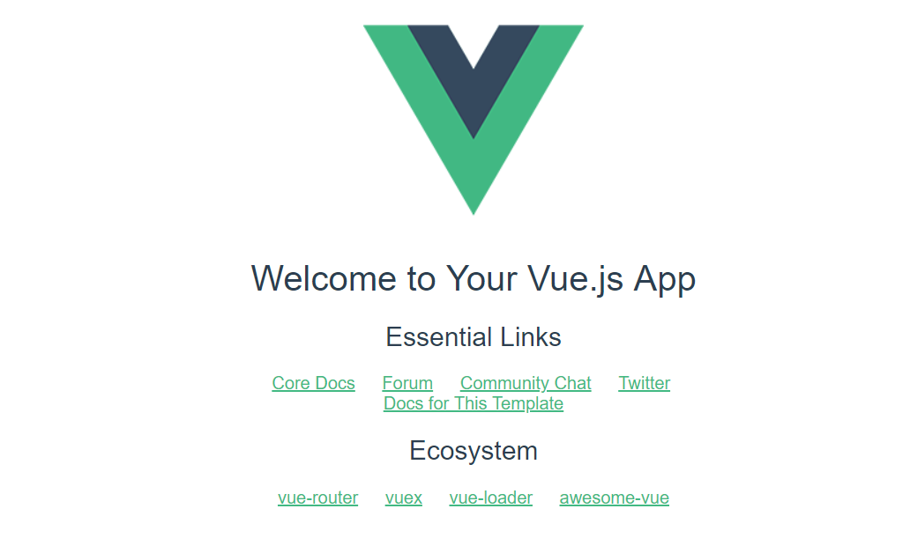
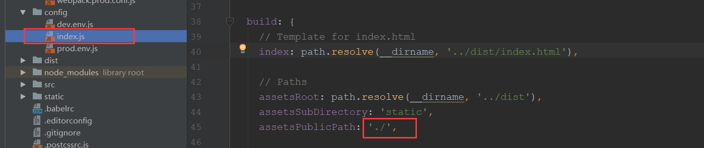

# electron配置相关

### 安装nodejs

    brew install node

### 搭建vue开发环境

    npm install -g cnpm --registry=https://registry.npm.taobao.org；

### 搭建vue项目

    vue init webpack demo



成功之后修改启动项，打开demo>config>index.js,具体修改如下：



执行命令，出现如下效果说明项目已经运行成功：
**npm run dev**  


执行生成命令： **npm run build**  


### 安装electron

    npm install electron
    
    root账户安装出错时，使用如下命令解决
    
    npm install -g electron --unsafe-perm=true --allow-root --registry=https://registry.npm.taobao.org
    
    --unsafe-perm:默认为false,如果为true则使用root用户安装，默认为非root用户安装 —allow-root: 允许root
    
    将 electron版本文件放到一下目录，加快安装
    
        Linux: $XDG_CACHE_HOME或~/.cache/electron/
        MacOS: ~/Library/Caches/electron/
        Windows: $LOCALAPPDATA/electron/Cache或~/AppData/Local/electron/Cache/

安装成功后执行：electron -v 查看一下是否安装成功


### 创建主程序入口main.js和package.json

main.js

```
    const {app, BrowserWindow} =require('electron');//引入electron
let win;
let windowConfig = {
  width:800,
  height:600
  icon: __dirname + ‘/Icon/Icon.icns’,
  webPreferences: {
    nodeIntegrationInWorker: true, //使打包的应用也使用nodejs
    nodeIntegration: true
 },
};//窗口配置程序运行窗口的大小
function createWindow(){
  win = new BrowserWindow(windowConfig);//创建一个窗口
  win.loadURL(`file://${__dirname}/index.html`);//在窗口内要展示的内容index.html 就是打包生成的index.html
  win.webContents.openDevTools();  //开启调试工具
  win.on('close',() => {
    //回收BrowserWindow对象
    win = null;
  });
  win.on('resize',() => {
    win.reload();
  })
}
app.on('ready',createWindow);
app.on('window-all-closed',() => {
  app.quit();
});
app.on('activate',() => {
  if(win == null){
    createWindow();
  }
});
```

package.json

```
{
  "name": "demo",
  "productName": "项目名称",
  "author": "作者",
  "version": "1.0.4",//版本号
  "main": "main.js",//主文件入口
  "description": "项目描述",
  "scripts": {
        "start": "electron main.js",
        "package": "electron-packager ./ --appname=redeye --platform=win32 --out=./build --arch=x64 --electron-version=6.0.10 --icon=./icon.ico --ignore=/'(cache|db.json)' --overwrite",
        "dist": "electron-builder --win --x64"
    },
    "build": {
        "appId": "com.tony.app",
        "productName": "redeye",
        "electronVersion": "6.0.10",
        "copyright": "tony",
        "nsis": {
            "oneClick": false, //是否一键安装
            "allowElevation": true, // 允许请求提升。 如果为false，则用户必须使用提升的权限重新启动安装程序。
            "allowToChangeInstallationDirectory": true, // 允许修改安装目录
            "installerIcon": "./build/icons/aaa.ico",// 安装图标
            "uninstallerIcon": "./build/icons/bbb.ico",//卸载图标
            "installerHeaderIcon": "./build/icons/aaa.ico", // 安装时头部图标
            "createDesktopShortcut": true, // 创建桌面图标
            "createStartMenuShortcut": true,// 创建开始菜单图标
            "shortcutName": "xxxx", // 图标名称
            "include": "build/script/installer.nsh", // 包含的自定义nsis脚本
        },
        "mac": {
            "icon": "build/icons/icon.icns",
            "target": [
                "dmg",
                "zip"
            ]
        },
        "win": {
            "icon": "build/icons/icon.ico",
            "target": [
                "nsis",
                "zip"
            ]
        }
    },
    "appId": "demo",//程序id
    "artifactName": "demo-${version}-${arch}.${ext}",
    "nsis": {
      "artifactName": "demo-${version}-${arch}.${ext}"
    },
    "extraResources": [
      {
        "from": "./static/xxxx/",//需要打包的静态资源
        "to": "app-server",//静态资源存放路径
        "filter": [
          "**/*"//打包静态资源文件夹内的所有文件  如果没有静态资源要打包进去，extraResources 这段代码去掉
        ]
      }
    ],
    "publish": [
      {
        "provider": "generic",
        "url": "http://xxxxx/download/"//自动更新的安装包地址，初步使用publish这段代码不需要
      }
    ]
  },
  "dependencies": {
    "core-js": "^2.4.1",
    "electron-packager": "^12.1.0",//不打包成exe程序可以去掉
    "electron-updater": "^2.22.1",//不打包成exe程序可以去掉
  }
}
```

### 查看预览

    执行命令： electron .

### 打包成软件包

    npm install electron-builder
    npm install electron-package
    
    执行打包命令：electron-bulider

### electron-builder 由于网络原因无法下载问题解决

    在package.json的build中添加electron的镜像
    "electronDownload": {
          "mirror": "https://npm.taobao.org/mirrors/electron/"
    }
    
    如果还是下载不了相关的包，那么就下载二进制包放进缓存目录，各操作系统包的位置如下：
    
        macOS ~/Library/Caches/electron-builder
        linux ~/.cache/electron-builder
        windows %LOCALAPPDATA%\electron-builder\cache


如果这样还是没法下载，建议：

> 直接从[electron包地址](https://github.com/electron/electron/releases)下载最新的`electron`包，然后放到｀~/.electron ｀目录下，重新执行 electron-prebuilt 即可，原理 electron-download 模块会把下载好的文件放到用户目录的 .electron 中，如果存在即不会重新下载。此方法同样适用于打包工具 electron-package、electron-builder


# 使用appdmg打包成dmg文件

```
npm install -g appdmg
```

appdmg.json配置如下:

```
{

    "title": "TradingView",
    "icon": "assets/icons/tradingview.icns",
    "contents": [
        {"x": 380, "y": 170, "type": "link", "path": "/Applications"},
        {"x": 200, "y": 170, "type": "file", "path": "build/tradingview-darwin-x64/tradingview.app"}
    ],
    "window": {
        "size": {
            "width": 580,
            "height": 360
        }
    },
    "format": "UDBZ"
}
```

最后使用

```
appdmg appdmg.json xxx.dmg
```

