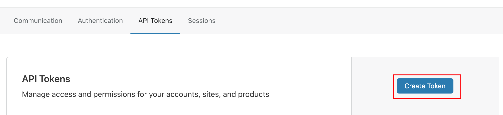

# 使用acme.sh申请SSL证书并定时更新


#### 一、安装 acme.sh 脚本

acme.sh 的脚本安装非常简单，只需要在终端中执行如下命令：
```
curl https://get.acme.sh | sh

acme.sh --set-default-ca --server letsencrypt

```
（如果系统未安装 curl 工具，请先进行安装）


#### 二、验证域名并生成证书

acme.sh 验证域名的方式一般有两种方式：HTTP 验证和 DNS 验证。

HTTP 验证的方式是需要往域名特定的 url 下面放置一个 txt 文件，用于验证你确实拥有该域名。

本文推荐的方式是使用 DNS 验证的方式，使用这种方式可以通过使用域名解析商提供的 API 自动添加 DNS 的 txt 记录来完成验证，是最简单、最快捷的方式。使用这种方式无需验证 IP，可以方便地实现 SSL 证书的自动申请和续签。


2. CloudFlare
如果你的域名解析商是 CloudFlare，那么你可以采用这种方式来验证域名。

首先，你需要申请一个 CloudFlare 的 API KEY，打开 [https://dash.cloudflare.com/profile/api-tokens](https://dash.cloudflare.com/profile/api-tokens) ，Create Token：



按后续提示操作，生成具有更新 DNS 权限的 API Key。

可以将 CloudFlare 登录邮箱和 Key 放到终端的环境变量中：

```
vi ~/.bashrc
```
把 Key 和 Secret 添加到文件末尾：
```
export CF_Email="xxxxxx"
export CF_Key="xxxxxx"
```
使环境变量生效：
```
source ~/.bashrc
```
查看域名的dns解析是否正确
```
acme.sh  --issue  --dns  -d godruoyi.com -d *.godruoyi.com
```
下面执行如下命令来验证域名（以 example.com 域名为例）并生成证书：
```
acme.sh --issue --dns dns_cf -d example.com -d *.example.com
```
执行后的结果：
```
[Fri Oct 23 13:21:09 CST 2020] Your cert is in  /root/.acme.sh/ example.com/ example.com.cer 
[Fri Oct 23 13:21:09 CST 2020] Your cert key is in  /root/.acme.sh/ example.com/ example.com.key 
[Fri Oct 23 13:21:09 CST 2020] The intermediate CA cert is in  /root/.acme.sh/example.com/ca.cer 
[Fri Oct 23 13:21:09 CST 2020] And the full chain certs is there:  /root/.acme.sh/example.com/fullchain.cer
```
你可以将 nginx 等 SSL 配置指向该目录，也可以使用如下命令，将证书安装到指定目录：
```
acme.sh --issue --dns dns_cf -d example.com -d *.example.com\
--installcert\
--key-file /etc/nginx/cert.d/example.com.key\
--fullchain-file /etc/nginx/cert.d/example.com.pem\
--reloadcmd "nginx -s reload"
```

服务器终端输入一下命令

```
acme.sh --installcert --issue -d "yourdomain.com" -d "*.yourdomain.com" --dns dns_cf \
--key-file       /home/ubuntu/ssl/yourdomain.key  \
--fullchain-file /home/ubuntu/ssl/yourdomain.pem \
--reloadcmd "systemctl restart nginx"
```

将 yourdomain.com 替换为自己的域名，* 表示泛域名证书，也一并修改
key file 和 fullchain file 目录可以按照实际需求更改
reloadcmd 表示证书部署后需要执行的命令，按照实际情况修改，我这边是 docker 部署的 Nginx，直接重启了对应的 docker 容器
脚本会去 cloudflare 设置一条验证的解析记录，默认等待 900 秒，cloudflare 生效很快，不用修改，如果慢的话，可设置 --dnssleep 1600 参数，数字为等待时间，单位为秒

#### 二、自动续期

执行完上述命令之后，脚本会在 cron 定时任务中加上一个定时任务，用于定期检查证书是否过期，并且自动更新 SSL 证书。使用如下命令可以查看该定时任务：
```
crontab -l
```
#### 三、更新 acme.sh

目前由于 acme 协议和 Let’s Encrypt! 会时常更新，因此需要对 acme.sh 脚本进行更新：
```
acme.sh --upgrade
```
也可以开启自动更新：
```
acme.sh --upgrade --auto-upgrade
```
关闭自动更新：
```
acme.sh --upgrade --auto-upgrade 0
```

移除域名证书自动更新

```
acme.sh --remove -d yourdomain.com -d "*.yourdomain.com"
```


#### nginx的安全性配置
```
在http块中添加如下

# /etc/nginx/snippets/ssl-params.conf


server_tokens   off;

ssl_session_cache        shared:SSL:10m;
ssl_session_timeout      60m;

ssl_session_tickets      on;

ssl_stapling             on;
ssl_stapling_verify      on;

resolver                 8.8.4.4 8.8.8.8  valid=300s;
resolver_timeout         10s;
ssl_prefer_server_ciphers on;

# 证书路径 绝对地址
ssl_certificate          /etc/nginx/ssl/fullchain.cer;
ssl_certificate_key      /etc/nginx/ssl/godruoyi.key;

ssl_protocols            TLSv1 TLSv1.1 TLSv1.2;

ssl_ciphers "EECDH+AESGCM:EDH+AESGCM:ECDHE-RSA-AES128-GCM-SHA256:AES256+EECDH:DHE-RSA-AES128-GCM-SHA256:AES256+EDH:ECDHE-RSA-AES256-GCM-SHA384:DHE-RSA-AES256-GCM-SHA384:ECDHE-RSA-AES256-SHA384:ECDHE-RSA-AES128-SHA256:ECDHE-RSA-AES256-SHA:ECDHE-RSA-AES128-SHA:DHE-RSA-AES256-SHA256:DHE-RSA-AES128-SHA256:DHE-RSA-AES256-SHA:DHE-RSA-AES128-SHA:ECDHE-RSA-DES-CBC3-SHA:EDH-RSA-DES-CBC3-SHA:AES256-GCM-SHA384:AES128-GCM-SHA256:AES256-SHA256:AES128-SHA256:AES256-SHA:AES128-SHA:DES-CBC3-SHA:HIGH:!aNULL:!eNULL:!EXPORT:!DES:!MD5:!PSK:!RC4";

add_header Strict-Transport-Security "max-age=31536000;includeSubDomains;preload";
add_header  X-Frame-Options  deny;
add_header  X-Content-Type-Options  nosniff;
add_header x-xss-protection "1; mode=block";
add_header Content-Security-Policy "default-src 'self'; script-src 'self' 'unsafe-inline' 'unsafe-eval' blob: https:; connect-src 'self' https:; img-src 'self' data: https: blob:; style-src 'unsafe-inline' https:; font-src https:";

```

```
# /etc/nginx/nginx.conf

http {
    ....
    ssl_protocols TLSv1 TLSv1.1 TLSv1.2;
}
```